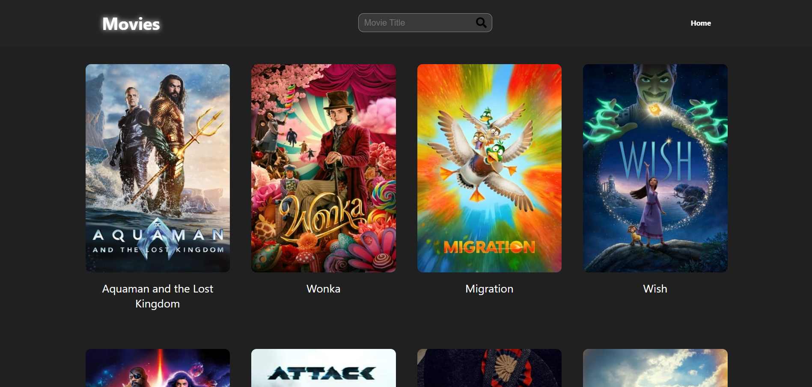

<h1 align="left">Movie App (whith API integration)</h1>

   

<h3 align="left">The core concept involves leveraging the capabilities of React for building interactive and modular user interfaces, while CSS is employed for styling to achieve a polished and cohesive design. The integration of a movie API ensures that the website stays up-to-date with the latest movie information, providing users with a comprehensive and real-time cinematic experience.</h3>

- 💻 This project is available at [https://movie-searcher-react.netlify.app](https://movie-searcher-react.netlify.app)

- 👨‍💻 All of my projects are available at [https://enrique-spinelli-port.vercel.app](https://enrique-spinelli-port.vercel.app)

- 📫 How to reach me **enriquespinelli.coder@gmail.com**

## 🌐 Socials:
 
